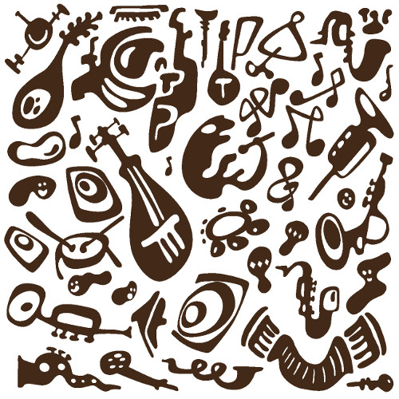

Appel à participation aux animations de la soirée
#################################################

:slug: animations-samedi-soir
:date: 2016-06-27
:summary: Tous acteurs de la fête !

Pour la soirée nous avons prévu de la musique, beaucoup de musique.

Nous avons loué un piano, venez avec votre instrument pour compléter
l'orchestre et animer la soirée (tamtam, voix, flûte, contrebasse,
guitare, violon, trombone, trompette, saxophone, harmonica, yukulélé,
accordéon, clarinette, etc...)

N'oubliez pas de l'apporter c'est vraiment important pour que la fête
soit réussie.

Vous pouvez préparer un morceau ou vous greffez à un ensemble sous la
houlette de Cédric. Les improvisations et accompagnement des chants
seront aussi les bienvenus.

Pour faciliter l'organisation musicale de la soirée n'hésitez pas à contacter
Cédric Beyer.

Un carnet de chants est en préparation, si vous avez des idées ou
envies particulières n'oubliez pas de vérifier qu'il est bien dedans
auprès d'Amandine et Cédric.

Si vous avez des idées ou des envies d'animations non musicales, elles
sont aussi les bienvenues, pour cela contactez Amandine Herry.

- **Cédric Beyer**: beyer.cedric+mariage@gmail.com
- **Amandine Herry**: herry.amandine+mariage@gmail.com

